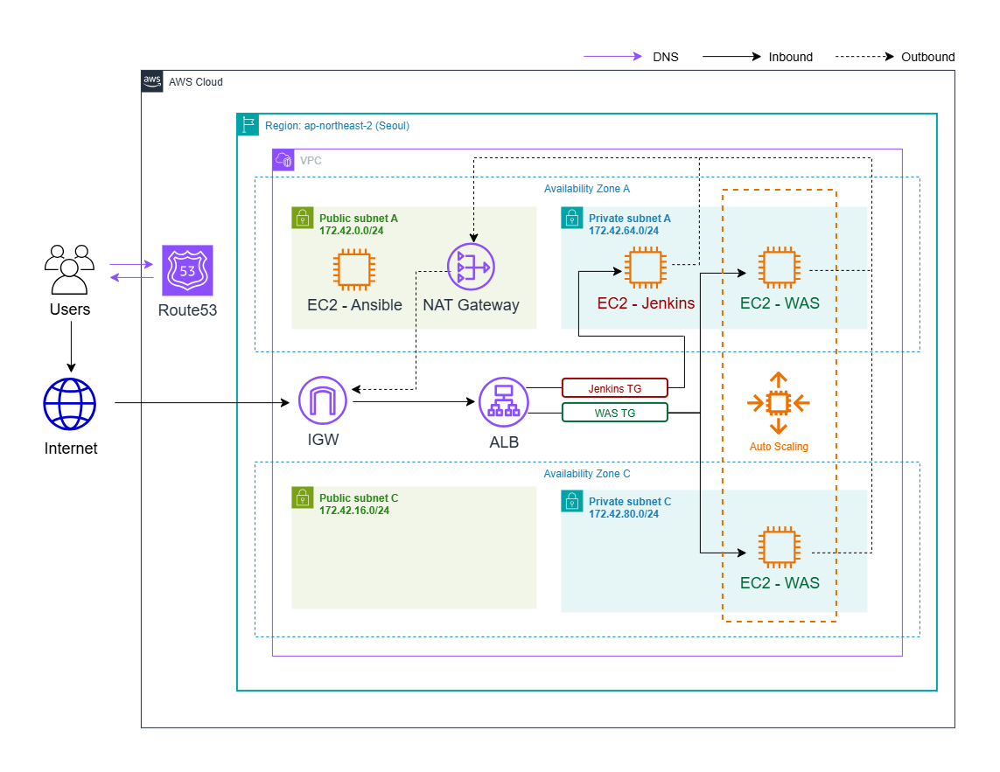
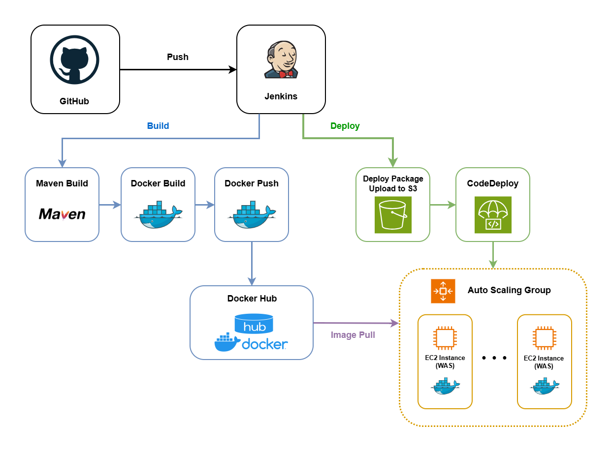

# IaC를 활용한 AWS 인프라 구축 및 CI/CD 자동화

---

# 📌 프로젝트 소개

본 프로젝트는 **Spring PetClinic 애플리케이션을 대상으로 AWS 인프라를 구축하고, Ansible을 활용한 IaC(Infrastructure as Code)와 Jenkins 및 AWS CodeDeploy를 이용한 CI/CD 환경을 구현한 개인 프로젝트**입니다.

고가용성을 고려하여 VPC, Public/Private Subnet, NAT Gateway, Application Load Balancer(ALB), Auto Scaling Group(ASG) 등 AWS 인프라를 구성하였으며, Ansible Playbook을 활용하여 인프라 구축을 자동화했습니다.

또한 GitHub에 소스코드를 Push하면 Jenkins가 자동으로 애플리케이션을 빌드하고 AWS CodeDeploy를 통해 EC2 인스턴스에 배포되도록 CI/CD 파이프라인을 구축하여 반복적인 배포 작업을 자동화하고 운영 효율성을 향상시켰습니다.

---

# 🎯 프로젝트 목표

- AWS 환경에서 실제 서비스 운영을 고려한 고가용성 인프라를 설계하고 구축한다.
- Ansible을 활용한 IaC(Infrastructure as Code)를 적용하여 반복적인 인프라 구축 작업을 자동화한다.
- Jenkins와 AWS CodeDeploy를 활용하여 GitHub 소스 변경부터 빌드 및 배포까지 CI/CD 파이프라인을 구현한다.
- Spring PetClinic 애플리케이션을 대상으로 자동화된 배포 환경을 구축하여 DevOps 운영 방식을 경험한다.

---

# 🏗 Architecture

## AWS Infrastructure Architecture

## CI/CD Pipeline Architecture

---

# 🛠 기술 스택

| 구분 | 기술 |
|---|---|
| Cloud | AWS EC2, VPC, ALB, Auto Scaling, Route 53, S3 |
| IaC / Automation | Ansible |
| CI/CD | Jenkins, AWS CodeDeploy |
| Build | Maven |
| Container | Docker, Docker Hub |
| Application | Spring PetClinic |
| Version Control | GitHub |

---

# ☁ AWS 인프라 구성

## Network

| 구분 | 구성 |
|---|---|
| Region | ap-northeast-2 (Seoul) |
| VPC | 172.42.0.0/16 |
| Availability Zones | ap-northeast-2a, ap-northeast-2c |
| Public Subnet A | 172.42.0.0/24 |
| Public Subnet C | 172.42.16.0/24 |
| Private Subnet A | 172.42.64.0/24 |
| Private Subnet C | 172.42.80.0/24 |
| Public Route | 0.0.0.0/0 → Internet Gateway |
| Private Route | 0.0.0.0/0 → NAT Gateway |
| NAT Gateway | Public Subnet A에 단일 구성 |

2개의 Availability Zone에 Public/Private Subnet을 분산 구성하였으며,
Public Subnet은 Internet Gateway를 통해 외부와 통신하도록 구성했습니다.

Jenkins 및 WAS 인스턴스를 Private Subnet에 배치하여 외부에 직접 노출하지 않고, NAT Gateway를 통해 필요한 아웃바운드 인터넷 통신이 가능하도록 구성했습니다.

## EC2

| 구분 | 구성 |
|---|---|
| Jenkins | Private Subnet A, 172.42.64.100 |
| App Origin | Public Subnet A에서 임시 생성 후 AMI 생성 및 종료 |
| WAS | Private Subnet A/C, Auto Scaling Group으로 관리 |
| Instance Type | t3.medium |
| OS | Ubuntu 24.04 LTS |
| Launch Template | App Origin 기반 AMI 사용 |
| Auto Scaling | Min 1 / Desired 2 / Max 3 |
| Health Check | ELB |

Jenkins 서버는 Private Subnet A에 고정 사설 IP로 배치하고 Public IP를 할당하지 않았습니다.

WAS는 Docker와 CodeDeploy Agent가 설치된 App Origin 인스턴스로부터 AMI를 생성한 뒤,
해당 AMI를 Launch Template에 적용하여 Auto Scaling Group이 Private Subnet A/C에 인스턴스를 생성하도록 구성했습니다.

## Security Group

| 구분 | 허용 포트 | Source |
|---|---|---|
| SSH SG | TCP 22 | 0.0.0.0/0 |
| Web SG | TCP 80, 443 | 0.0.0.0/0 |
| SSM Endpoint SG | TCP 443 | 172.42.0.0/16 |

※ 실습 환경에서는 SSH 접근을 위해 22번 포트를 전체 대역에 허용했으며, 운영 환경에서는 관리자 IP 대역으로 제한하는 것이 적절합니다.

## ALB / Target Group

| 구분 | 구성 |
|---|---|
| ALB | Public Subnet A/C에 배치 |
| Listener | HTTP 80 |
| Jenkins Target Group | IP 방식, 172.42.64.100:80 |
| Jenkins Health Check | HTTP `/login` |
| App Target Group | Instance 방식, Port 80 |
| App Health Check | HTTP `/` |
| Routing | Host Header 기반 분기 |
| Jenkins Domain | user02-jenkins.busanit.com |
| App Domain | user02-app.busanit.com |

Application Load Balancer를 두 Public Subnet에 배치하고 Host Header 기반 라우팅을 구성했습니다.

`user02-jenkins.busanit.com` 요청은 Jenkins Target Group으로,
`user02-app.busanit.com` 요청은 Auto Scaling Group과 연결된 App Target Group으로 전달되도록 구성했습니다.

## Route 53

| 구분 | 구성 |
|---|---|
| Hosted Zone | busanit.com |
| Jenkins | user02-jenkins.busanit.com → ALB |
| Application | user02-app.busanit.com → ALB |
| Record Type | A (Alias) |

Route 53에서 Jenkins와 Application 도메인을 동일한 Application Load Balancer로 연결하였습니다.

두 도메인의 요청은 ALB로 전달되며, ALB의 Host Header 기반 라우팅 규칙에 따라 Jenkins Target Group과 App Target Group으로 각각 전달되도록 구성했습니다.

> Route 53 레코드는 Ansible 자동화 대상에 포함하지 않고 AWS Management Console에서 직접 구성했습니다.

---

# 🤖 IaC (Ansible)

---

# 🔄 CI/CD Pipeline

---

# 📂 프로젝트 구조

---

# ⚙ 구축 과정

---

# ⚠ Trouble Shooting

---

# 📈 성과

---

# 💡 배운 점
